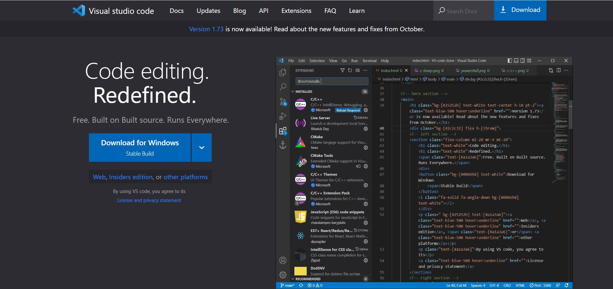

# Workflow of VS-Code Clone Project   

## `Note` -
    This project does not promote or encourage any illegal activities, all the code is written by me for Educational purpose.

**Output** - 

## Approach that i followed was - 
1. In this project i used `tailwind-CSS` for Home page design where i had multiple `tailwind` properties.
2. I had used some `icons` from the `fontawesome-icon` and some picture by taking screenshots.